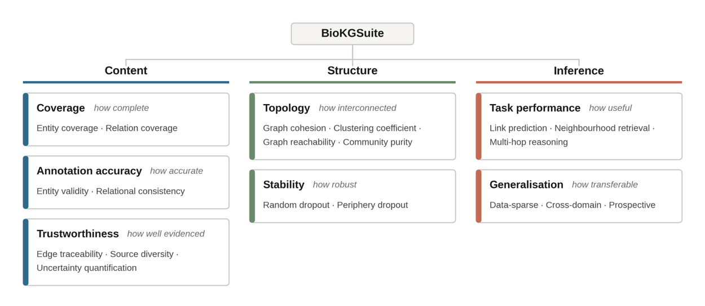
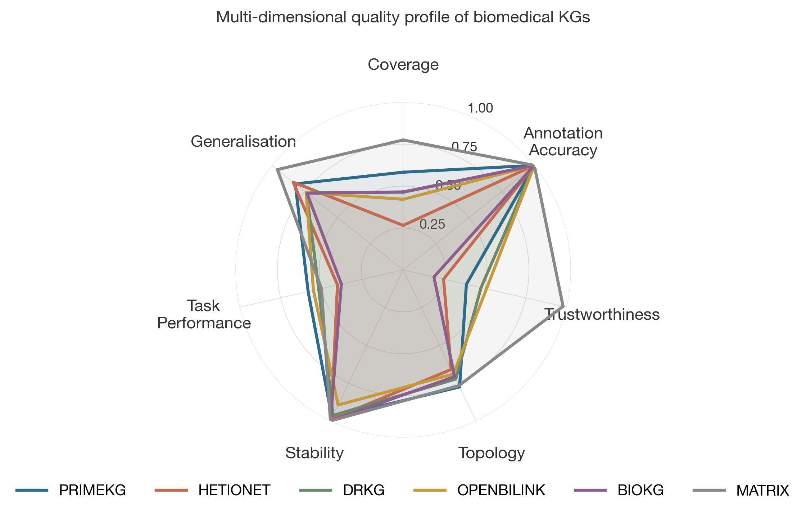
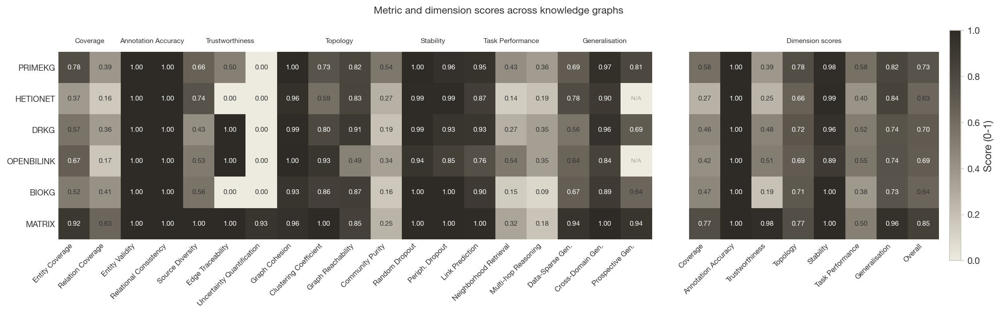
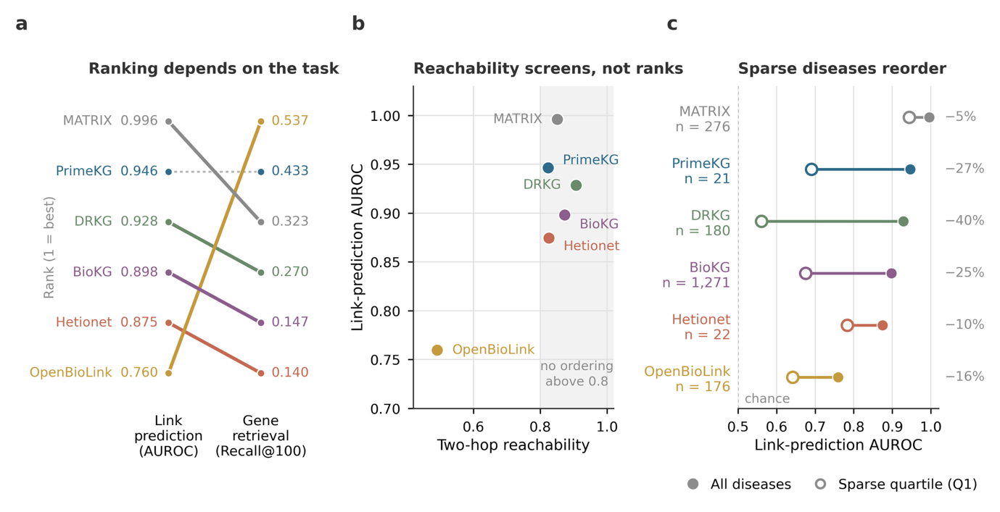
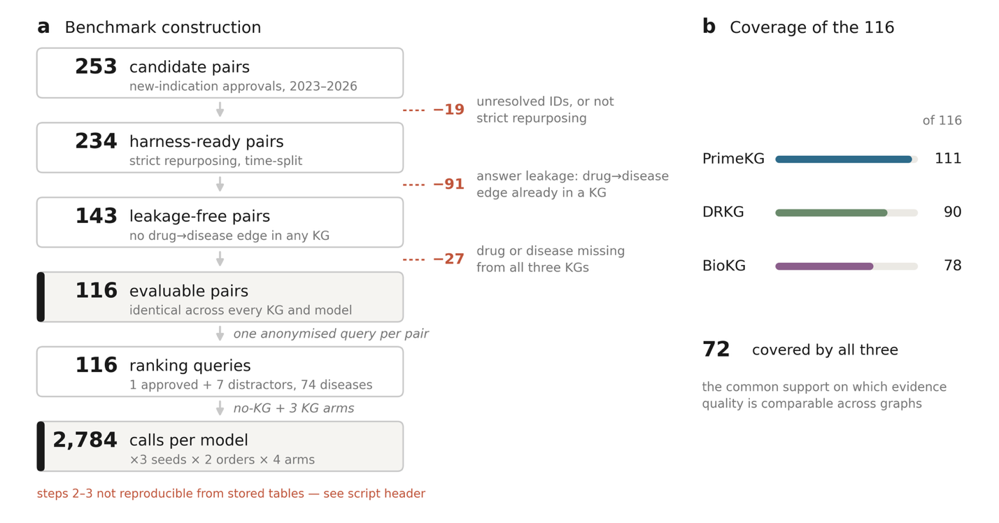
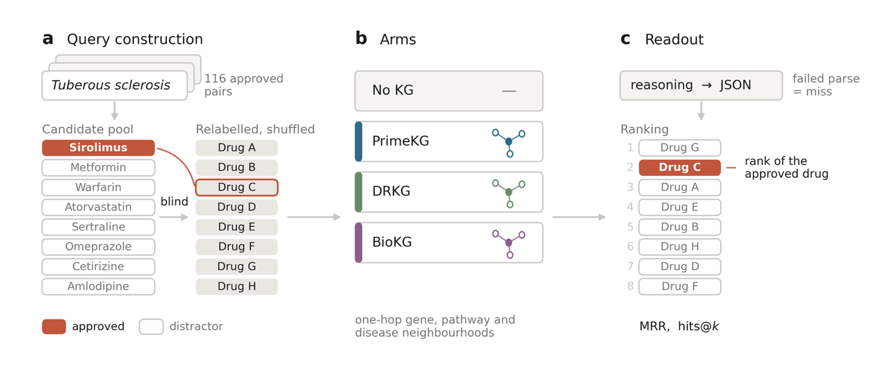

**Title: Multidimensional quality profiles govern how biomedical knowledge graphs support drug repurposing**

**Abstract:** Biomedical knowledge graphs (KGs) guide computational hypothesis generation and increasingly ground AI models, yet no standardized framework exists to evaluate their fitness for purpose. Existing assessments rely on isolated proxies such as size or predictive accuracy, which neither characterize a KG holistically nor reflect specific downstream tasks. We present BioKGSuite, a framework that evaluates biomedical KGs across seven dimensions spanning content, structure, and inference, operationalized through an extensible pipeline that accepts new KGs and task-specific reference data. Applied to six widely used KGs, it produces multidimensional quality profiles that expose patterns invisible to conventional assessment, most notably that size alone fails to predict quality, with the smallest resource ranking among the best on generalization. To test whether these profiles are decision-relevant, we use three KGs to ground large language models on a prospective drug-repurposing benchmark. Grounding raises ranking accuracy from a chance-level 0.28 to 0.62--0.73 across model families, and a KG's quality profile governs the size of the gain. BioKGSuite thus makes KG selection a principled, task-aware choice.

**Introduction**

Biomedical knowledge graphs (KGs) encode the entities of molecular biology and medicine---genes, proteins, drugs, diseases, phenotypes, and pathways---together with the relationships among them, integrating knowledge otherwise fragmented across publications, ontologies, and databases into a single computable network. Over the past decade they have moved from a niche resource to standard research infrastructure. Dedicated catalogs such as the KG-Registry now list more than 100 biomedical KGs \[1\], and the number of publications employing them has grown roughly fiftyfold since the mid-2010s (from 15 PubMed records in 2015--2017 to 776 in 2023--2025). This growth is driven by tasks where evidence is scattered and the stakes are high, spanning the prioritization of drug--target and gene--disease associations \[2\], the prediction of drug--drug interactions \[3\], and the repurposing of approved drugs \[4, 5\]; rare-disease diagnosis \[6\] and treatment-response prediction in oncology \[7\]; and, increasingly, the grounding of large language models through retrieval-augmented generation \[8\]. In each setting, the KG is the substrate on which downstream predictions, and ultimately biomedical hypotheses, rest.

Yet the substrate itself is rarely scrutinized. New biomedical KGs are introduced with descriptive statistics of scale, node and edge counts, and the number of integrated sources, and where they are compared with existing resources at all, the comparison is one of coverage rather than quality \[4, 9\]. However, scale alone is a poor proxy for value, and aggressively aggregating a KG can degrade rather than improve performance. A study using the Monarch KG, a widely used biomedical KG, found that a filtered subset comprising 11% of the KG outperformed the full version on link prediction \[12\]. Similarly, a study of drug--drug interactions found that merely integrating additional drug KGs failed to improve interaction prediction \[13\]. This may be driven in part by what aggregation actually adds. Because biomedical sources concentrate disproportionately on well-studied entities, larger KGa may amplify the degree and literature biases that lead models to favour heavily connected, frequently reported nodes over biologically plausible ones \[14\].

If quantity is not what determines a KG's value, its composition must be. Yet it is far from clear that what a KG contains is correct. Assembled by integrating dozens of heterogeneous, independently curated sources, biomedical KGs are known to be incomplete and noisy \[14, 15\]. Automated checking of a widely used biomedical KG surfaced more than ninety factual errors \[16\], and sparse or noisy relations remain a recurring obstacle to reliable inference \[17, 18\]. Quality problems are therefore both real and consequential, yet the field has no shared way to measure them.

In practice, quality is judged ad hoc by one-dimensional proxies, most often accuracy on a link-prediction benchmark \[19, 35\]. Such proxies are inconsistent across studies and capture only a narrow facet of quality. Scored under random negative sampling, link-prediction accuracy is distorted by degree bias \[36, 37\] and inflated by train--test leakage, and drops sharply on realistic prospective inference sets \[20\]. Performance on it does not reliably transfer to the downstream tasks practitioners care about \[38\], so a KG that scores well on paper may fail in deployment. Further, even resources that explicitly provide benchmarks often evaluate the algorithms trained on a KG rather than the KG itself \[10, 11\], so the substrate is never the object of evaluation.

Where dedicated quality frameworks exist, they remain either taxonomic or narrow in scope. General-purpose frameworks define richer dimensions such as accuracy, completeness, provenance, and timeliness \[21, 22, 39\], but were developed for linked data at large rather than for biomedicine, and have neither been adopted as a domain standard nor operationalized into reproducible pipelines. Recent efforts to evaluate biomedical KGs directly are each narrow in different ways. Cortes et al. \[24\] score 16 KGs against community reusability standards, but assess transparency and reuse rather than the content quality of the graph; multidimensional content-quality evaluations have so far been applied only to individual, domain-specific KGs, and assess content alone, without the structural and inference dimensions that determine whether a graph supports reliable inference \[25, 26\]; and broader medical data-quality frameworks target machine-learning datasets rather than KGs \[27\].

Underlying all of these is the shared assumption that quality can be defined once, independently of use. The idea that quality is instead fitness for purpose has been articulated \[23\], but the dimensions it implies are rarely applied in practice \[40, 41\]. In biomedicine this matters, because different applications impose fundamentally different demands on a KG. Drug repurposing, one of the most common applications of biomedical KGs \[28, 29\], depends on coverage of the compound and disease space, since a KG that omits an entity cannot generate hypotheses involving it, and on short mechanistic paths connecting drugs to diseases through targets and pathways \[30\]; its value lies in recovering novel associations, particularly for rare diseases, placing direct demands on task performance and generalisation. Drug--target identification is instead a local retrieval problem, in which true targets must be ranked above nearby candidates, so the discriminative burden falls on topology and the density of local neighbourhoods \[31\]. Polypharmacy prediction hinges on complete coverage of drug--drug interactions, where a missing interaction is a missing safety signal, and on traceable evidence and robustness to incompleteness, since errors propagate into clinical decisions \[32\]. Disease--gene prioritisation ranks candidate genes by their connectivity to observed phenotypes \[33, 34\], but its research value lies precisely where prior evidence is thinnest, making generalisation under sparsity the defining constraint. Clinical outcome prediction shifts the emphasis from discovery to accountability. Predictions that inform care must be traceable to their supporting evidence and stable across data revisions, since a risk stratification that changes with routine re-curation cannot be trusted \[29\].

No single dimension suffices for any of these tasks, and no two share the same priority profile (Supplementary Table S1). Quality is therefore not a single number but a profile, and its interpretation depends on the intended downstream application. Researchers selecting a biomedical KG lack both: a principled, multidimensional standard, and any basis for relating it to the task at hand.

Here, we present BioKGSuite, a multidimensional framework for the systematic evaluation of biomedical KGs. It defines seven quality dimensions for biomedical KGs spanning content (coverage, annotation accuracy, trustworthiness), structure (topology, stability), and inference (task performance, generalisation), and operationalises each through concrete metrics that a researcher can compute, inspect, and substitute. The dimensions are derived from graph structure rather than learned representations, so evaluation is inexpensive, auditable at the level of individual edges, and extensible to new KGs and task-specific reference data through an open pipeline.

We apply the framework end to end to six widely used biomedical KGs (Hetionet, DRKG, PrimeKG, BioKG, OpenBioLink, and MATRIX) with gold standards tailored to drug repurposing, producing the first side-by-side multidimensional quality profiles for these resources. The profiles expose patterns invisible to conventional assessment. Size alone fails to predict quality, with the smallest resource ranking among the best on generalisation; only one KG provides calibrated confidence scores for its individual facts; and predictive accuracy falls by roughly a quarter on the sparsely annotated diseases that repurposing most needs. No KG dominates every dimension.

Finally, we test whether these profiles are decision-relevant rather than merely descriptive. Using the three KGs with sufficient task coverage, we ground large language models on a prospective, leakage-controlled drug-repurposing benchmark. Grounding raises ranking accuracy from a chance-level baseline to 0.62--0.73 across three model families, and a KG's quality profile governs the size of that gain. Profiles that predict downstream performance can therefore guide two decisions. Researchers selecting a KG can match dimensional strengths to the requirements of their task, and developers can diagnose quality gaps and prioritise curation across dimensions.

**Results**

*BioKGSuite evaluates knowledge graph quality across seven dimensions*

BioKGSuite evaluates biomedical KG quality across seven dimensions spanning content, structure, and inference (Figure 1), reflecting a conceptual progression from what a KG contains, to how it is organised, to what it can support in practice. Each dimension addresses a distinct, non-redundant aspect of KG quality.

We organise dimensions across content, structure, and inference because they correspond to distinct and largely independent failure modes, an organisation that general-purpose quality taxonomies \[21, 22, 23\] do not provide for biomedical KGs \[40, 41\]. A KG may contain the right entities but connect them sparsely, leaving drug and disease nodes unreachable within the short paths that mechanistic reasoning requires \[42\]. It may be densely connected yet record no provenance for its edges, so that predictions cannot be audited. It may be internally consistent yet fragile, with node rankings that shift when peripheral edges are removed \[43\]. And it may support link prediction on well-studied entities while failing precisely where evidence is thinnest. Which of these failures matters depends on what the KG is being used for, which is why dimensions are reported separately rather than combined.

**\
**

**Fig. 1 \| The BioKGSuite evaluation framework.**

{width="5.680555555555555in" height="2.4722222222222223in"}

Seven quality dimensions organized across content, structure, and inference. Each dimension is operationalised through one or more metrics computed from the graph\'s released format together with task-specific reference standards, giving 19 metrics in total (Supplementary Table S2).

Dimensions are operationalised through one or more metrics, 19 in total, chosen as concrete instances rather than an exhaustive list (Supplementary Table 2). Because every metric is computed from a KG's released format and curated reference data, without retraining or additional annotation, they are inexpensive to reproduce and adaptable to other applications by substituting reference standards. Metrics are normalised to \[0, 1\] and aggregated to dimension scores by unweighted mean, indicating relative rather than absolute sufficiency (Methods).

The seven dimensions are task-general, but the reference data that operationalises them is not. Coverage is measured against the entities a task requires, task performance against the associations it aims to predict, and generalisation against the settings in which it must hold. Instantiating BioKGSuite therefore means choosing reference standards, and we do so here for drug repurposing, one of the most prevalent and well-defined biomedical KG applications.

Six knowledge graphs were evaluated: Hetionet, DRKG, PrimeKG, BioKG, OpenBioLink, and MATRIX, selected because they are widely used, publicly available, and general-purpose rather than disease-specific, and because they span a wide range of scale, relation vocabulary, and construction philosophy (Table 1). Five categories of reference data instantiate the dimensions: entity references from DrugBank 6.0, UniProt, and the Disease Ontology; relation references from DrugBank and Open Targets; task-performance benchmarks using Open Targets indication pairs as positives with negatives at three difficulty levels \[KotnisNastase2017\]; a multi-hop gold standard from the Comparative Toxicogenomics Database; and post-cutoff FDA indication approvals for prospective generalisation.

**Table 1 \| Properties of the six evaluated biomedical knowledge graphs.**

  **Knowledge graph**   **Release year**   **Nodes**   **Edges**    **Relation types**   **Entity types**   **Primary sources**
  --------------------- ------------------ ----------- ------------ -------------------- ------------------ ---------------------
  Hetionet              2017               47,031      2,250,197    24                   11                 29
  BioKG                 2020               93,773      5,088,434    51                   5                  15
  DRKG                  2020               97,238      5,874,261    107                  13                 7
  OpenBioLink           2020               180,992     4,563,407    28                   7                  8
  PrimeKG               2022               129,375     4,050,249    30                   10                 20
  MATRIX                2025               7,350,000   81,150,000   91                   58                 95

Knowledge graphs are ordered by release year. MATRIX figures are for release v0.15.19 and are reported to three significant figures as given in the release summary; all other figures are exact. Evaluation of MATRIX used the canonical drug, disease, gene, pathway, and phenotype subset (Methods).

*Quality profiles differ sharply across six knowledge graphs*

Applying BioKGSuite to the six graphs produces the first side-by-side multidimensional quality profiles for these resources (Figs. 2, 3). The profiles are neither interchangeable nor rank-ordered, differing in shape rather than in overall magnitude. We consider four consequences of this divergence.

**Fig. 2 \| Multidimensional quality profiles of six biomedical knowledge graphs.**

{width="5.443537839020123in" height="3.479861111111111in"}

Dimension scores across the seven BioKGSuite quality dimensions, normalised to \[0, 1\], with larger radius indicating higher relative performance. Lines denote PrimeKG (dark blue), Hetionet (orange), DRKG (green), OpenBioLink (yellow), BioKG (purple), and MATRIX (grey). Underlying values are given in Figure 3.

**Fig. 3 \| Metric and dimension scores across six biomedical knowledge graphs.**

{width="6.919191819772529in" height="2.170967847769029in"}

All 19 BioKGSuite metrics, grouped by quality dimension (left), and the dimension scores derived from them as unweighted group means, with the overall mean (right). Scores are normalised to \[0, 1\] and darker cells indicate higher values; N/A marks metrics not evaluable for a given graph.

**Graphs converge on the dimensions that quality taxonomies foreground and diverge on those they do not.** Annotation accuracy is saturated, with entity validity between 0.998 and 1.000 and relational consistency at 1.000 in all six graphs. Accuracy is the canonical first dimension of general data-quality frameworks \[21, 22, 23\], but as an identifier- and schema-level check it no longer discriminates among these resources. Trustworthiness, by contrast, spans 0.188 to 0.978, the widest range of any dimension, and the divergence is one of absence rather than degree. Uncertainty quantification is exactly zero in five of six graphs; only MATRIX annotates edges with confidence (0.934). Per-edge provenance is absent entirely from Hetionet and BioKG and partial in PrimeKG (0.500). Whether a prediction can be weighted by evidence or traced to a source therefore separates these graphs sharply, while the dimension most prominent in existing quality frameworks does not.

**Which graph performs best depends on the task.** Task performance is not a single capability, and no ranking obtained on one task generalises to another. On drug--disease link prediction the ordering is MATRIX (AUROC 0.996), PrimeKG (0.946), DRKG (0.928), BioKG (0.898), Hetionet (0.874) and OpenBioLink (0.760). On disease-to-gene retrieval it is nearly reversed at the extremes: OpenBioLink attains the highest performance (Recall\@100 = 0.537) while MATRIX falls to third (0.323), and Hetionet moves from fifth to last (0.140). Four of the six graphs change rank between the two tasks, and only PrimeKG holds its position (Fig. 4a). A KG selected on the basis of one task benchmark may therefore be a poor choice for a different application on the same resource, which is why the intended task must be specified before quality is assessed rather than after.

**These differences originate in construction decisions and are visible in graph structure.** OpenBioLink provides the clearest illustration. Its construction applies source-specific confidence thresholds that exclude lower-scoring edges \[44\], and the accompanying loss of path redundancy leaves it the only graph in which most drug--disease pairs are not connectable within two hops (reachability 0.492, against 0.824--0.907 for the others). Because neighbourhood-based scoring functions are defined over shared neighbours and assign zero to pairs having none \[37\], low reachability bounds achievable link-prediction performance irrespective of any other property (Fig. 4b). The same thresholds nevertheless preserve the dense gene and pathway neighbourhoods that target retrieval exploits. A single construction decision thus accounts for both OpenBioLink\'s weakest and its strongest task performance. This is where measuring structure separately from performance earns its place. A task benchmark records only that a KG underperforms; structural properties identify why, attribute the underperformance to a specific construction decision, and indicate what would have to change to remedy it.

**Aggregate performance conceals differential degradation.** All six graphs discriminate known drug--disease pairs well in aggregate (AUROC 0.760--0.996), but performance on the least-annotated quartile of diseases falls by between 5% and 40%, and the ordering changes substantially (Fig. 4c). DRKG, third in aggregate (0.928), falls to last on sparse entities at 0.561, barely above the 0.5 expected by chance; Hetionet, fifth in aggregate (0.874), rises to second (0.784). The differences between KGs also widen rather than narrow under sparsity, whereby aggregate scores span 0.236 across the six resources and sparse-tier scores span 0.383. Because aggregate benchmarks are dominated by well-connected entities, they both understate how much these graphs differ and misidentify which performs best in the regime where repurposing offers most value. A KG chosen on average performance may retain almost no discriminative signal for the rare and under-studied diseases it would be selected to investigate.

**Fig. 4 \| Task performance depends on the task, on graph structure, and on the density of the entities queried.**

{width="6.268055555555556in" height="3.213888888888889in"}

**a**, Rank of each knowledge graph on drug--disease link prediction (AUROC) and on disease-to-gene retrieval (Recall\@100), with the underlying values shown at each end. Solid lines denote graphs that change rank between tasks; the dotted line denotes PrimeKG, the only graph holding its position. **b**, Reachability against link-prediction AUROC. Shading marks the five graphs above 0.8, within which reachability does not order performance. **c**, Link-prediction AUROC across all diseases (filled circles) and restricted to the least-annotated quartile (open circles), with the percentage change at right and the number of positive pairs in the sparse tier below each graph name. The dashed line marks the 0.5 expected by chance.

Taken together, these patterns describe what a multidimensional profile reveals that an aggregate score cannot: which dimensions discriminate between resources, which task a given graph is suited to, why it is suited to it, and where its apparent performance degrades. Whether such profiles also predict how useful a graph proves in practice, rather than merely characterising it, is tested next.

*LLM grounding gains depend on quality of KG evidence*

To determine what the quality profiles BioKGSuite produces imply for practice, we experimented with KG grounding for LLMs, in which retrieved evidence from the KG constrains generation to improve factual accuracy \[45, 46\]. KGs have been used in this way to prioritise therapeutic candidates \[47\], yet the KG is almost always fixed rather than compared, so its contribution cannot be separated from that of the model. To address this, we constructed a prospective, leakage-controlled evaluation set from regulatory approvals postdating the release of every KG tested and designed a ranking experiment that varies the KG supplying the evidence.

Filtering 253 new indications approved between 2023 and 2026 for unresolved identifiers, answer leakage and absent entities left 116 pairs across 74 diseases, differing from the discarded pairs only in drug age (Fig. 5a and 5b, Supplementary Table S3). OpenBioLink and Hetionet covered too few for a per-graph estimate (46 and 4 of 253), and MATRIX postdates the approval boundary, leaving PrimeKG, DRKG and BioKG as the testable KGs.

**Fig. 5 \| Construction of the prospective, leakage-controlled evaluation set.**

{width="6.4848479877515315in" height="3.3930500874890637in"}

**a**, Successive filters applied to 253 new-indication approvals granted between 2023 and 2026, with the pairs removed at each stage shown at right. Each retained pair yields one anonymised ranking query containing the approved drug and seven distractors drawn from approved drugs not indicated for the disease, evaluated across three seeds, two candidate orderings and four arms. **b**, Number of the 116 retained pairs contained in each knowledge graph. The 72 pairs present in all three constitute the common support on which evidence quality can be compared independently of coverage.

Each query presents one disease with a pool of eight candidate drugs, exactly one of which received the approval, and asks the model to rank them by mechanistic plausibility (Fig. 6). Distractors are approved drugs not indicated for the disease, sampled afresh at each seed. All eight are relabelled Drug-A to Drug-H and shuffled, so that no candidate can be recognised by name and no drug--indication association recalled directly---an important step, as the LLM's training cutoff cannot be verified. Arms differ solely in the evidence attached to each candidate. The baseline arm attaches none, and each KG arm attaches one-hop gene, pathway, and disease neighbourhoods rendered as text. The prompt requires reasoning before the ranking \[48\] and a JSON response, with failed parses scored as misses (Methods).

**Fig. 6 \| Design of the KG grounding experiment.**

{width="6.535353237095363in" height="2.70042760279965in"}

**a**, Each query pairs one disease with a pool of eight candidate drugs, exactly one of which received the approval. The other seven are approved drugs with no indication for that disease, sampled at every seed. All eight are relabelled Drug A--H and shuffled. **b**, Arms differ solely in the evidence attached to each candidate. The baseline arm attaches none; each knowledge-graph arm attaches that candidate\'s one-hop gene, pathway, and disease neighbourhood, rendered as text. **c**, The prompt requires reasoning before the ranking and a JSON response. Failed parses are scored as misses. Performance is the mean reciprocal rank and hits@*k* of the approved drug.

We evaluated three LLMs spanning providers and licensing\--GPT-4.1-mini and Gemini-3.1-Flash-Lite from two independent closed providers and Llama-3.3-70B with open weights\--together with a within-family series from Llama-3.2-1B to Llama-3.1-405B testing how the grounding gain scales with capacity.

Because the candidates are anonymised, the baseline arm's performance accordingly defines an uninformed floor (MRR of 0.262, 0.228, and 0.304 for GPT-4.1-mini, Gemini-3.1-Flash-Lite, and Llama-3.3-70B, against 0.340 expected under uniform random ranking). Attaching KG evidence raises ranking accuracy substantially, as expected. However, the magnitude of the gain depends on which KG supplied the evidence.

PrimeKG produces the largest gain, followed by BioKG and then DRKG, and this ordering is identical in GPT-4.1-mini, Gemini-3.1-Flash-Lite and Llama-3.3-70B (Fig. 7a). Within a single model the choice of KG moves ranking accuracy by 0.069 to 0.111, a range comparable to the 0.097 to 0.121 separating the three models when the KG is held fixed. The profiles in Fig. 3 provide two explanations for this ordering. A KG may supply better evidence, relating to the content and structural dimensions described, or it may supply evidence more often, which coverage alone quantifies. The two are confounded in the observed ranking, since PrimeKG contains 111 of the 116 queried pairs against 90 for DRKG and 78 for BioKG, and a pair a KG does not contain yields an empty evidence block that reduces that arm to the baseline condition.

**\[Figure 7\]**

These two explanations are separable. Restricting the comparison to the 76 pairs present in all three KGs, we see that the gains become indistinguishable (Fig. 7b). Grounding continues to raise ranking accuracy substantially, by 0.291 to 0.313 in GPT-4.1-mini and by 0.401 to 0.428 in Gemini-3.1-Flash-Lite, but no pairwise difference between graphs is distinguishable from zero in either model, the largest being 0.027 mean reciprocal rank (95% confidence interval −0.028 to 0.082). The ordering also ceases to be consistent, GPT-4.1-mini placing BioKG first and Gemini-3.1-Flash-Lite placing PrimeKG first (Fig. 7b). The advantage observed across the full set is therefore attributable to how often a KG contains the queried evidence rather than to differences in the evidence it supplies when it does.

Coverage therefore accounts for the difference in grounding gain observed between the KGs. Notably, which dimension proves decisive is a property of the application rather than of the KG and is recoverable only from a profile that reports quality dimensions separately.

**Discussion**

**Methods**

**Data Availability**

**Code Availability**

**References**

**Acknowledgements**

**Author Contributions**

**Competing Interests**

**References**

**\[1\]** KG-Registry, biomedical domain. <https://kghub.org/kg-registry/> (accessed July 2026).

**\[2\]** Buniello, A. et al. Open Targets Platform: facilitating therapeutic hypotheses building in drug discovery. *Nucleic Acids Res.* **53**, D1467--D1475 (2025). [DOI](https://doi.org/10.1093/nar/gkae1128)

**\[3\]** Yu, Y., Huang, K., Zhang, C., Glass, L.M., Sun, J. & Xiao, C. SumGNN: multi-typed drug interaction prediction via efficient knowledge graph summarization. *Bioinformatics* **37**, 2988--2995 (2021). [DOI](https://doi.org/10.1093/bioinformatics/btab207)

**\[4\]** Himmelstein, D.S. et al. Systematic integration of biomedical knowledge prioritizes drugs for repurposing. *eLife* **6**, e26726 (2017). [DOI](https://doi.org/10.7554/eLife.26726)

**\[5\]** Bang, D., Lim, S., Lee, S. & Kim, S. Biomedical knowledge graph learning for drug repurposing by extending guilt-by-association to multiple layers. *Nat. Commun.* **14**, 3570 (2023). [DOI](https://doi.org/10.1038/s41467-023-39301-y)

**\[6\]** Fei, Y., Ding, H., Tong, S., He, Y. & Cai, W. Application of knowledge graphs in rare disease research. *Front. Public Health* **14**, 1757612 (2026). [DOI](https://doi.org/10.3389/fpubh.2026.1757612)

**\[7\]** Zhao, L. et al. Biological knowledge graph-guided investigation of immune therapy response in cancer with graph neural network. *Brief. Bioinform.* **24**, bbad023 (2023). [DOI](https://doi.org/10.1093/bib/bbad023)

**\[8\]** Soman, K. et al. Biomedical knowledge graph-optimized prompt generation for large language models. *Bioinformatics* **40**, btae560 (2024). [DOI](https://doi.org/10.1093/bioinformatics/btae560)

**\[9\]** Chandak, P., Huang, K. & Zitnik, M. Building a knowledge graph to enable precision medicine. *Sci. Data* **10**, 67 (2023). [DOI](https://doi.org/10.1038/s41597-023-01960-3)

**\[10\]** Breit, A., Ott, S., Agibetov, A. & Samwald, M. OpenBioLink: a benchmarking framework for large-scale biomedical link prediction. *Bioinformatics* **36**, 4097--4098 (2020). [DOI](https://doi.org/10.1093/bioinformatics/btaa274)

**\[11\]** Walsh, B., Mohamed, S.K. & Nováček, V. BioKG: A Knowledge Graph for Relational Learning on Biological Data. *Proc. CIKM \'20*, 3173--3180 (2020).

**\[12\]** Bradshaw, M.S., Gaskell, A. & Layer, R.M. The effects of biological knowledge graph topology on embedding-based link prediction. bioRxiv 2024.06.10.598277. **PREPRINT**

**\[13\]** Celebi, R. et al. Evaluation of knowledge graph embedding approaches for drug-drug interaction prediction in realistic settings. *BMC Bioinformatics* **20**, 726 (2019). [DOI](https://doi.org/10.1186/s12859-019-3284-5)

**\[14\]** MacLean, F. Knowledge graphs and their applications in drug discovery. *Expert Opin. Drug Discov.* **16**, 1057--1069 (2021). [DOI](https://doi.org/10.1080/17460441.2021.1910673)

**\[15\]** Rossi, A., Barbosa, D., Firmani, D., Matinata, A. & Merialdo, P. Knowledge Graph Embedding for Link Prediction: A Comparative Analysis. *ACM Trans. Knowl. Discov. Data* **15**, 1--49 (2021). [DOI](https://doi.org/10.1145/3424672)

**\[16\]** Lin, X. et al. BioKGBench: A Knowledge Graph Checking Benchmark of AI Agent for Biomedical Science. arXiv:2407.00466 (2024). **PREPRINT**

**\[17\]** Pujara, J., Augustine, E. & Getoor, L. Sparsity and Noise: Where Knowledge Graph Embeddings Fall Short. *Proc. EMNLP 2017*, 1751--1756 (2017).

**\[18\]** Ma, T. et al. Learning to Denoise Biomedical Knowledge Graph for Robust Molecular Interaction Prediction. *IEEE Trans. Knowl. Data Eng.* (2024). [DOI](https://doi.org/10.1109/TKDE.2024.3471508)

**\[19\]** Alshahrani, M., Thafar, M.A. & Essack, M. Application and evaluation of knowledge graph embeddings in biomedical data. *PeerJ Comput. Sci.* **7**, e341 (2021). [DOI](https://doi.org/10.7717/peerj-cs.341)

**\[20\]** Brière, G. et al. Benchmarking the Impact of Data Leakage on the Performance of Knowledge Graph Embedding Models for Biomedical Link Prediction. bioRxiv 2025.01.23.634511 (2025). **PREPRINT**

**\[21\]** Wang, R.Y. & Strong, D.M. Beyond accuracy: What data quality means to data consumers. *J. Manag. Inf. Syst.* **12**, 5--33 (1996).

**\[22\]** Zaveri, A., Rula, A., Maurino, A., Pietrobon, R., Lehmann, J. & Auer, S. Quality assessment for Linked Data: A survey. *Semantic Web* **7**, 63--93 (2016).

**\[23\]** Chen, H., Cao, G., Chen, J. & Ding, J. A practical framework for evaluating the quality of knowledge graph. *China Conference on Knowledge Graph and Semantic Computing (CCKS 2019)*, Springer, 111--122 (2019).

**\[24\]** Cortes, K.G. et al. Improving Biomedical Knowledge Graph Quality: A Community Approach. arXiv:2508.21774 (2025). **PREPRINT**

**\[25\]** Liu, C. et al. Research on Traditional Chinese Medicine: Domain Knowledge Graph Completion and Quality Evaluation. *JMIR Med. Inform.* **12**, e55090 (2024). [DOI](https://doi.org/10.2196/55090)

**\[26\]** Nguyen, H., Chen, H., Chen, J., Kargozari, K. & Ding, J. Construction and evaluation of a domain-specific knowledge graph for knowledge discovery. *Information Discovery and Delivery* (2023). [DOI](https://doi.org/10.1108/IDD-06-2022-0054)

**\[27\]** Schwabe, D., Becker, K., Seyferth, M., Klaß, A. & Schaeffter, T. The METRIC-framework for assessing data quality for trustworthy AI in medicine: a systematic review. *npj Digit. Med.* **7**, 203 (2024). [DOI](https://doi.org/10.1038/s41746-024-01196-4)

**\[28\]** Jarada, T.N., Rokne, J.G. & Alhajj, R. A review of computational drug repositioning: strategies, approaches, opportunities, challenges, and directions. *J. Cheminform.* **12**, 46 (2020). [DOI](https://doi.org/10.1186/s13321-020-00450-7)

**\[29\]** Li, M.M., Huang, K. & Zitnik, M. Graph representation learning in biomedicine and healthcare. *Nat. Biomed. Eng.* **6**, 1353--1369 (2022). [DOI](https://doi.org/10.1038/s41551-022-00942-x)

**\[30\]** Wei, Y. et al. Multi-hop reasoning over biomedical knowledge graphs for drug repurposing. Preprint (2025). *\[add arXiv/bioRxiv ID\]*

**\[31\]** Mei, J.-P., Kwoh, C.-K., Yang, P., Li, X.-L. & Zheng, J. Drug--target interaction prediction by learning from local information and neighbors. *Bioinformatics* **29**, 238--245 (2013). [DOI](https://doi.org/10.1093/bioinformatics/bts670)

**\[32\]** Nováček, V. & Mohamed, S.K. Predicting polypharmacy side-effects using knowledge graph embeddings. *AMIA Jt. Summits Transl. Sci. Proc.* **2020**, 449--458 (2020).

**\[33\]** Bromberg, Y. Disease gene prioritization. *PLoS Comput. Biol.* **9**, e1002902 (2013). [DOI](https://doi.org/10.1371/journal.pcbi.1002902)

**\[34\]** Gnanaolivu, R.D. et al. Knowledge-graph-based prioritisation of disease--gene associations for rare and complex disorders. Preprint (2025). *\[add ID\]*

**\[35\]** Chang, D., Balažević, I., Allen, C., Chawla, D., Brandt, C. & Taylor, A. Benchmark and best practices for biomedical knowledge graph embeddings. *Proc. BioNLP 2020*, 167--176 (2020).

**\[36\]** Kotnis, B. & Nastase, V. Analysis of the impact of negative sampling on link prediction in knowledge graphs. arXiv:1708.06816 (2017). **PREPRINT**

**\[37\]** Liben-Nowell, D. & Kleinberg, J. The link prediction problem for social networks. *J. Am. Soc. Inf. Sci. Technol.* **58**, 1019--1031 (2007). [DOI](https://doi.org/10.1002/asi.20591)

**\[38\]** Gema, A.P., Grabarczyk, D., De Wulf, W., Borole, P., Alfaro, J.A., Minervini, P., Vergari, A. & Rajan, A. Knowledge graph embeddings in the biomedical domain: are they useful? A look at link prediction, rule learning, and downstream polypharmacy tasks. *Bioinform. Adv.* **4**, vbae097 (2024). [DOI](https://doi.org/10.1093/bioadv/vbae097)

**\[39\]** Debattista, J., Lange, C., Auer, S. & Cortis, D. Evaluating the quality of the LOD cloud: an empirical investigation. *Semantic Web* **9**, 859--901 (2018). [DOI](https://doi.org/10.3233/SW-180307)

**\[40\]** Paulheim, H. Knowledge graph refinement: a survey of approaches and evaluation methods. *Semantic Web* **8**, 489--508 (2017). [DOI](https://doi.org/10.3233/SW-160218)

**\[41\]** Xue, B. & Zou, L. Knowledge graph quality management: a comprehensive survey. *IEEE Trans. Knowl. Data Eng.* **35**, 4969--4988 (2023). [DOI](https://doi.org/10.1109/TKDE.2022.3150080)

**\[42\]** Watts, D.J. & Strogatz, S.H. Collective dynamics of \'small-world\' networks. *Nature* **393**, 440--442 (1998). [DOI](https://doi.org/10.1038/30918)

**\[43\]** Albert, R., Jeong, H. & Barabási, A.-L. Error and attack tolerance of complex networks. *Nature* **406**, 378--382 (2000). [DOI](https://doi.org/10.1038/35019019)

**\[44\]** Breit, A., Ott, S., Agibetov, A. & Samwald, M. OpenBioLink: a benchmarking framework for large-scale biomedical link prediction. *Bioinformatics* **36**, 4097--4098 (2020). [DOI](https://doi.org/10.1093/bioinformatics/btaa274)

**\[45\]** Joy, J. & Su, A. I. Federated knowledge retrieval elevates large language model performance on biomedical benchmarks. *GigaScience* **15**, giag007 (2026).

**\[46\]** Matsumoto, N. et al. KRAGEN: a knowledge graph-enhanced RAG framework for biomedical problem solving using large language models. *Bioinformatics* **40**, btae353 (2024).

**\[47\]** Wei, C.-H. et al. Large language models meet biomedical knowledge graphs for mechanistically grounded therapeutic prioritization. Preprint at arXiv 2604.19815 (2026).

\[**48**\] Wei, J. et al. Chain-of-thought prompting elicits reasoning in large language models. *Adv. Neural Inf. Process. Syst.* **35**, 24824--24837 (2022).

**Supplementary Materials**

**Supplementary Table S1 \| Use-case-to-dimension mapping.**

**\[Table S1\]**

● = critical, ◐ = important, ○ = less relevant. Priorities are derived from the mechanics of each task as described in the cited literature, rather than from empirical measurement.

**Supplementary Table S2 \| BioKGSuite metric definitions.**

All 19 metrics across seven quality dimensions. Higher scores indicate stronger relative performance in all cases. Dimension scores are the unweighted mean of their constituent metrics.

  ------------------------- ---------------------------- --------------------------------------------------------------------------------------------------------- -------------------------------------------------------------------------- ----------------------------------------- ---------------------------------------------
  **Dimension**             **Metric**                   **Definition**                                                                                            **Quantification**                                                         **Reference data**                        **Score mapping**
  **Coverage**              Entity coverage              Fraction of gold-standard entities present in the KG, per entity type                                     \|KG ∩ gold\| / \|gold\| for each shared canonical type; macro-averaged    DrugBank 6.0; UniProt; Disease Ontology   Direct proportion (0--1)
                            Relation coverage            Fraction of known gold-standard relation pairs present in the KG                                          \|KG ∩ gold pairs\| / \|gold pairs\| per relation type; macro-averaged     DrugBank; Open Targets                    Direct proportion (0--1)
  **Annotation accuracy**   Entity validity              Fraction of entity identifiers passing prefix/regex validation for their canonical type                   Valid IDs / total IDs; macro-averaged across shared types                  Canonical identifier schemas              Direct proportion (0--1)
                            Relational consistency       Fraction of edges whose head--relation--tail triple conforms to the declared schema                       Conforming edges / total edges                                             KG-declared schema                        Direct proportion (0--1)
  **Trustworthiness**       Source diversity             Number of distinct primary upstream databases contributing edges                                          Count of primary sources, normalised across evaluated KGs                  KG documentation                          Normalised count (0--1) \[confirm formula\]
                            Edge traceability            Resolution at which individual edges trace to their origin database                                       Ordinal tier: 0 = type-level only; 1 = per-node; 2 = per-edge provenance   KG metadata                               Tier 0 → 0.0; 1 → 0.5; 2 → 1.0
                            Uncertainty quantification   Fraction of edges carrying a numeric confidence or evidence-strength annotation                           Edges with ≥1 non-null score/confidence/weight column / total edges        KG edge attributes                        Direct proportion (0--1)
  **Topology**              Graph cohesion               Proportion of nodes in the largest connected component                                                    \|LCC\| / \|total nodes\|                                                  ---                                       Direct proportion (0--1)
                            Clustering coefficient       Tendency to form dense neighbourhoods relative to a random graph                                          C (5,000-node sample); C\_ER = ⟨k⟩ / N; ratio C / C\_ER                    ---                                       Log transform, ceiling at C/C\_ER = 100
                            Graph reachability           Fraction of gold-standard drug--disease pairs connectable by short paths after the test edge is removed   Recovery\@2-hops on held-out indication pairs                              Open Targets indications                  Direct proportion (0--1)
                            Community purity             Correspondence between detected communities and known entity types                                        Louvain (resolution 1.0); NMI against entity-type labels                   ---                                       Direct NMI (0--1)
  **Stability**             Random dropout               Preservation of Adamic--Adar rankings under uniform random edge removal                                   Spearman r at d ∈ {5, 10, 20}%; 10% used for scoring                       Open Targets indications                  CLES: (r₁₀ + 1) / 2
                            Periphery dropout            As above, but edges incident to lowest-degree nodes removed first                                         Spearman r at d ∈ {5, 10, 20}%; 10% used for scoring                       Open Targets indications                  CLES: (r₁₀ + 1) / 2
  **Task performance**      Link prediction              Discrimination of known pairs from type-constrained negatives using graph heuristics                      AUROC across Adamic--Adar, Jaccard, common neighbours                      Open Targets indications                  Adamic--Adar AUROC (0--1)
                            Neighbourhood retrieval      Retrieval of known partners among top-ranked graph-proximity neighbours                                   Recall\@K at K = 10, 50, 100; Recall\@100 used for scoring                 Open Targets; DrugBank                    Direct proportion (0--1)
                            Multi-hop reasoning          Recovery of known pairs via multi-hop traversal                                                           Hits\@K at K = 10, 50, 100; Hits\@100 used for scoring                     Comparative Toxicogenomics Database       Direct proportion (0--1)
  **Generalisation**        Data-sparse                  Link prediction on the least-annotated quartile of entities                                               AUROC on Q1-tier (lowest-degree) pairs                                     Open Targets indications                  Adamic--Adar AUROC (0--1)
                            Cross-domain                 Consistency of link prediction across therapeutic areas                                                   Mean AUROC across 8 domains; CV reported as dispersion                     Open Targets indications                  Mean Adamic--Adar AUROC (0--1)
                            Prospective                  Prediction of pairs approved after the KG construction cutoff                                             AUROC on post-cutoff pairs absent at build time                            FDA post-cutoff approvals                 Adamic--Adar AUROC (0--1)
  ------------------------- ---------------------------- --------------------------------------------------------------------------------------------------------- -------------------------------------------------------------------------- ----------------------------------------- ---------------------------------------------

*Note: the normalisation applied to source diversity should be confirmed against src/scoring.py before submission.*

**Supplementary Table S3 \| Selection-bias audit of the prospective evaluation set.**

Comparison of the 116 retained pairs against the 137 discarded at any filter stage, across six characteristics recorded before filtering. Retention rate gives the percentage of each group retained. Only drug age differs at P \< 0.05, retained drugs having received their original approval a median of two years more recently. Two-sided tests throughout; no correction for multiple comparisons, which would render all comparisons non-significant.

+-----------------------+----------------+--------------------+-----------------+-----------------+-------+
| **Characteristic**    | **Groups (n)** | **Retention rate** | **Effect size** | **Test**        | **P** |
+-----------------------+----------------+--------------------+-----------------+-----------------+-------+
| Oncology              | 116 / 137      | 41% vs 50%         | OR = 0.72       | Fisher\'s exact | 0.21  |
+-----------------------+----------------+--------------------+-----------------+-----------------+-------+
| Biologic modality     | 119 / 134      | 50% vs 42%         | OR = 1.42       | Fisher\'s exact | 0.21  |
+-----------------------+----------------+--------------------+-----------------+-----------------+-------+
| Multi-agency approval | 18 / 235       | 39% vs 46%         | OR = 0.74       | Fisher\'s exact | 0.63  |
+-----------------------+----------------+--------------------+-----------------+-----------------+-------+
| Strict repurposing    | 212 / 41       | 47% vs 39%         | OR = 1.40       | Fisher\'s exact | 0.39  |
+-----------------------+----------------+--------------------+-----------------+-----------------+-------+
| Therapeutic area      | 8 groups       | ---                | χ² = 10.8       | Chi-square      | 0.15  |
+-----------------------+----------------+--------------------+-----------------+-----------------+-------+
| Drug age (years since | 116 / 137      | median 6 vs 8      | Δ = 2 years     | Mann--Whitney   | 0.013 |
|                       |                |                    |                 |                 |       |
| original approval)    |                |                    |                 |                 |       |
+-----------------------+----------------+--------------------+-----------------+-----------------+-------+

**Therapeutic-area composition**

Counts of retained and discarded pairs by therapeutic area. \"Other\" aggregates areas with fewer than six pairs (Respiratory, GI, GI/Metabolic, Nephrology, Endocrine, Other). Oncology is the largest area in both groups and is retained at a lower rate than the remainder (41% against 50%), though the difference is not significant.

  ---------------------- -------------- --------------- -----------
  **Therapeutic area**   **Retained**   **Discarded**   **Total**
  Oncology               48             68              116
  Immunology             28             18              46
  Cardiovascular         8              10              18
  Infectious             7              9               16
  Metabolic              9              7               16
  CNS                    6              4               10
  Hematology             5              5               10
  Ophthalmology          4              2               6
  Other                  1              14              15
  **Total**              **116**        **137**         **253**
  ---------------------- -------------- --------------- -----------
